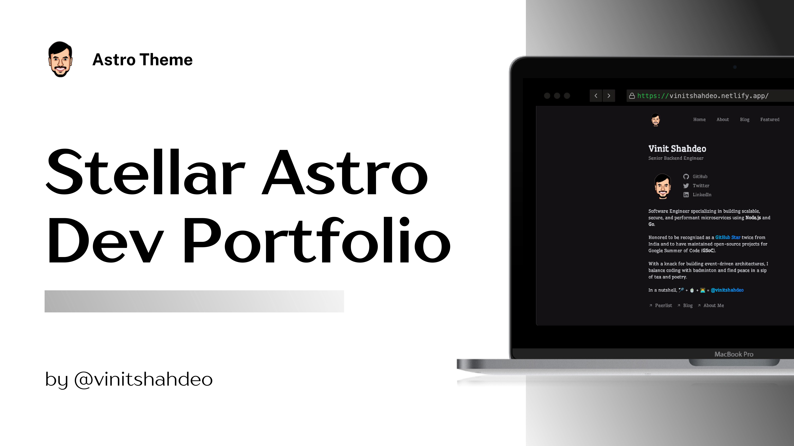

<div align="center">
    
    <h1 align="center">Astro Portfolio — Vinit Shahdeo</h1>
     <a href="https://astro.build"></a>
    <p align="center"><strong>Stellar Astro Dev Portfolio Template</strong></p><br/>
</div>

Welcome to the repository that hosts the source code for my portfolio, designed to showcase my work, skills, and featured articles, leveraging [Astro](https://astro.build/) and [Tailwind CSS](https://tailwindcss.com/). This is also available as the [Stellar Astro Dev Portfolio](https://astro.build/themes/) Template.

[](https://app.netlify.com/sites/vinitshahdeo/deploys) [](https://astro.build)  [](https://github.com/prettier/prettier)

The portfolio is currently live at [vinitshahdeo.netlify.app](https://vinitshahdeo.netlify.app) and is deployed on Netlify. This project is a free, open-source Astro theme that is both accessible and SEO-friendly. It draws inspiration from the [Minimal Portfolio Template](https://astro.build/themes/details/minimal-portfolio-template/) by [Tim Witzdam](https://github.com/TimWitzdam). This template can serve as a foundation for your personal portfolio. Start by using the command `npm init astro@latest --template vinitshahdeo/portfolio`. Feel free to customize it to fit your personal style and requirements.

> [!IMPORTANT]
> The source code is available under the [MIT License](./LICENSE), while the textual content and images are protected under [CC BY-NC-SA 4.0](https://creativecommons.org/licenses/by-nc-sa/4.0/).

## 🔥 Features

- 📱 **Fully Responsive**: Adapts smoothly to any screen size.
- ⚡ **Fast and SEO Optimized**: Ensures quick loading times and better search engine rankings. Incorporates comprehensive [Open Graph](https://ogp.me/) Meta tags for better social media sharing.
- 🎨 **Fully Customizable**: Tailor the template to fit your unique style and needs.
- 📄 **Comprehensive Pages**: Includes Home, About, and Featured pages.
- 🚀 **Self-Host Ready**: Easily deployable on your own hosting environment like [Netlify](https://www.netlify.com/) / [Vercel](https://vercel.com/).
- 📊 **Google Analytics Integration**: Simplified configuration for Google Analytics with your measurement ID.
- Auto generation of Robots.txt and Sitemap generator 

## 🧐 What's inside?

The portfolio contains three main pages:

- 🏠 **[Home](https://vinitshahdeo.netlify.app/)**: A welcome page with my brief introduction.
- 👤 **[About](https://vinitshahdeo.netlify.app/about/)**: Detailed information about me, my skills, and my experience.
- 📚 **[Featured](https://vinitshahdeo.netlify.app/featured/)**: My thoughts, stories, and interviews.
- 📆 **[Now](https://vinitshahdeo.netlify.app/now/)**: What I'm doing now? — This page is inspired by [Derek Sivers](https://nownownow.com/about)'s `/now` page. It's a great way to share what you're up to now.

## 📱 Demo

You can preview the demo by scanning the QR code below or visiting my portfolio at [vinitshahdeo.netlify.app](https://vinitshahdeo.netlify.app).


## 🚀 Getting Started

To use this template, execute one of the following commands based on your package manager:

```bash
# For npm 6.x
npm create astro@latest --template vinitshahdeo/portfolio

# For npm 7+ (note the extra double-dash):
npm create astro@latest -- --template vinitshahdeo/portfolio

# For yarn users
yarn create astro --template vinitshahdeo/portfolio
```

Follow the steps in the subsequent sections for local setup instructions or [open the source code](https://codespaces.new/vinitshahdeo/portfolio) in the codespace.

[](https://codespaces.new/vinitshahdeo/portfolio)

## 🛠️ Local Setup

1. Clone the repo

```
git clone https://github.com/vinitshahdeo/portfolio.git
cd portfolio
```

2. This requires Node 20 or higher.

```bash
nvm use
```

3. Install dependencies

```
npm i
```

4. Run the development server

```
npm run dev
```

> [!TIP]
> For enhanced Astro support in Visual Studio Code, it's highly recommended to install the [Astro VSCode extension](https://marketplace.visualstudio.com/items?itemName=astro-build.astro-vscode). This extension provides useful features such as syntax highlighting, IntelliSense, code formatting, and more, significantly improving your development experience with the [Stellar Astro Dev Portfolio](/) template.

## 🧞 Commands

Before running these commands, ensure you have Node.js and npm installed on your system. All commands should be executed from the root directory of the project, using a terminal.

| Command         | Action                                      | Notes                                                                                                                                              |
| :-------------- | :------------------------------------------ | :------------------------------------------------------------------------------------------------------------------------------------------------- |
| `npm install`   | Installs all necessary dependencies.        | This is the first command you should run after cloning the repository to install all the required packages.                                        |
| `npm run dev`   | Starts the local development server.        | Access the site at `http://localhost:4321`. The server will automatically reload if you make any changes to the source files.                      |
| `npm run build` | Builds the site for production.             | The output is stored in the `./dist/` directory. Use this command before deploying to ensure you're publishing the optimized version of your site. |
| `npm run lint`  | Lints your code to identify and fix issues. | It's recommended to run this command before committing your changes to ensure code quality and consistency.                                        |

## 🌐 Deployment

Deploying your site is a breeze with seamless support for both [Netlify](https://www.netlify.com/) and [Vercel](https://vercel.com/). Choose your preferred platform by clicking the buttons below. These options also automatically create a new repository on GitHub for you. For more details, explore the documentation:

1. [Deploy your Astro Site to Vercel](https://docs.astro.build/en/guides/deploy/vercel/)
2. [Deploy your Astro Site to Netlify](https://docs.astro.build/en/guides/deploy/netlify/)

[](https://app.netlify.com/start/deploy?repository=https://github.com/vinitshahdeo/portfolio) [](https://vercel.com/new/project?template=https://github.com/vinitshahdeo/portfolio)

Currently, this project is set up for deployment on **Netlify**. To switch to Vercel, update the adapter in [`astro.config.mjs`](./astro.config.mjs) after running `npx astro add vercel`.

```ts
import { defineConfig } from "astro/config";
import tailwind from "@astrojs/tailwind";
import icon from "astro-icon";

import vercel from '@astrojs/vercel/serverless';

export default defineConfig({
  integrations: [tailwind(), icon()],
  output: "hybrid",
  adapter: vercel()
  vite: {
    resolve: {
      alias: {
        "@styles": "/src/styles",
      },
    },
  },
});
```

## 📊 Google Analytics

To update your Google Analytics measurement ID, follow these steps in [analytics.ts](./src/config/analytics.ts). For detailed instructions, refer to [this guide](https://support.google.com/analytics/answer/9539598?hl=en). This setup includes optimization with [@astrojs/partytown](https://docs.astro.build/en/guides/integrations-guide/partytown/) to prevent page rendering delays.

```typescript
export const measurementId = "G-XXXXXXXX"; // Replace G-XXXXXXXX with your measurement ID.
```

## 🙏 Acknowledgment

This is inspired by [Minimal Portfolio Template](https://astro.build/themes/details/minimal-portfolio-template/) by [Tim Witzdam](https://github.com/TimWitzdam). The [`/now`](https://vinitshahdeo.netlify.app/now/) page is inspired by the [Now Page](https://sive.rs/nowff) movement.

## 📝 License

The source code of this project is licensed under the MIT License - see the [LICENSE](./LICENCSE) file for details. The words and images are licensed under [CC BY-NC-SA 4.0](https://creativecommons.org/licenses/by-nc-sa/4.0/).

## 📫 Contact

For any queries, feel free to get in touch via [Twitter](https://x.com/vinit_shahdeo) (𝕏) or follow me on [GitHub](https://github.com/vinitshahdeo).

[](https://github.com/vinitshahdeo/)

## 💙 Support

If you liked this project, leave a star or share the blog on Twitter to spread the word.

<!--

    ████████████████████████████████████████████████████████████████████████████████
    ████████████████████████████████▀▀▀╚╙╙╙╙╙▀██████████████████████████████████████
    ████████████████████████████▀╙╙└.  -      '╙▀▀██████████████████████████████████
    █████████████████████████▀╙"                  `╙╙▀██████████████████████████████
    ██████████████████████▀╙-                         ╙█████████████████████████████
    █████████████████████▒-                _.,╓░,._   ╚╫████████████████████████████
    █████████████████████▒ `          _.,░=j╠╠╠D▒░░░._ ╙████████████████████████████
    █████████████████████▒       _.;|░░░╦╠╠╠╠╠╠╠╠╠╠░░░` ║███████████████████████████
    █████████████████████▒  _==░░░|░[░░╠╠╠╠╠╠╠╠╠╠╠╠░░░⌐`[███████████████████████████
    █████████████████████▌- .|░░░░░▒░╠╠╠╠╠╠╠╠╠╠╠R╚╠░░░░ ║███████████████████████████
    ██████████████████████▒.:[░░╚╙╚╚╚╚╚╚░░░╚², .,░░░╠░░ ╠███████████████████████████
    ██████████████████████▌⌐|[[░░»=-  -![╔▒░: ``^░░░░[░`j╚██████████████████████████
    ██████████████████████▌H:ÜÜ░░░= _=:░╠╠▒▒░=░░|░░╔╠╠░░╩░║█████████████████████████
    ██████████████████████▒|░|▒░░░░░░╔╔░╠╠D╠╠▒░╔╠║╣▒▒╠╠░░╚║█████████████████████████
    ██████████████████████▒╚░╠╠╠╠╠╠╠╠╠╠╠╠╠D╠╠╠╠╠╠╬╬╠╠╠ÜÜ╠║║█████████████████████████
    ███████████████████████▒╚░╠╠╠╠╠╠╠░|╚╚╠╚╙╙╚╠╠╠╠╠╠╠╠░░╦╠╟█████████████████████████
    ███████████████████████▒R░╚░╠╠╚Ü░╚╚╙╙²╙^²²╚╠╠╠░░╚░░░║███████████████████████████
    ████████████████████████▄▄H╚░░░░^:=░░░░|░░==²!╚Ü░░░j████████████████████████████
    ███████████████████████████░░░░░░╔╔[╠╠▒╠░╔░╔╔░░░░░-╟████████████████████████████
    ███████████████████████████▌░╚░░░╚╠╠░╚╙╙╙░[╠░░░░² ╔█████████████████████████████
    █████████████████████████████░²^-²░╚╚RjjKKR░░░`  j██████████████████████████████
    █████████████████████████████▒H░  ''=╙╙²╙░²'`  _|░██████████████████████████████
    ████████████████████████████▀╙╠Ü░░__         _|░|Ü╚█████████████████████████████
    ██████████████████████████D⌐  ╠╠░░░░░░=░░░╔░░░|░╠╠ └╚███████████████████████████
    █████████████████████████D░░ [╠╠╠╠╠╠╔╠╔▒░[╠░░|╠░╠╠H :╙▀█████████████████████████
    ████████████████████████D░░░.'[╠╠╠╠╠╠╠╠╠╠╠╠╠╠╠╠╠╠╠╠H:░░░╙╙▀▀████████████████████
    ████████████████████▀╙╙:░░░░░░²╚╠╠╠╠╠╠╠╠╠╠╠╠╠╠░╠╠╠╠H=░░░░░░░░░╙╙▀▀██████████████
    ████████████████▀╙░:,,,:░░░░░░░:╚╠╠╠╠╠╠╠╠╠╠╠╠╠╠╠╠╠╠H|░░░░░░░|[░░░░░░░╙╚▀████████
    █████████████▀╙└:::::-,:░░░░░░░░,!╚╠╠╠╠╠╠╠╠╠╠╠╠║╣╣╝░|╠╙╚░░░░░░░░░░░|░░░░░╚██████
    ██████████▀╙:=:::::,:,-,░░░░░='`   ░"╙╚╠╠╠╠╠╠║╣▒▒R╚╚╚╙    `╙||░░░░░░░Ü░░░░╚█████
    ██████▀╙░»::::::::::::,-:░='            '╙╠╠╣╣▒╬▒         _╓╔|[░Ü░|░░░░░░:-╚████
    ████╙└:░░░░░░░░░░░░░::::,____ ``-----_    ²╚╣▒▒▒░=   `,;╔░░░░░╠░░░░░░░|░⌐:⌐|║███
    ██▌░-::::░░░░░░░░░░░░░░░░:,,,--,,,,,-,--.-` ╙╣▒░=` `,|░░░░░░░░░░░░░░░:|░:=░'╚███
    ██Ü-,::,:-:░░░░░░░░░░░░░░:,:::,::::::::::²!░░░=. ░,,|░░░░Ü░░░░░░░░░░░░░∩░': ░║██
    █▒----::----::░░░░░░=░░░░::::::::::::░░░░░░░░^ `||░░░░░░[░░░░░░░░░░░:░░--`- |║██
    █░-----::--`-::===░░░░░░░░░░░░░░░░░░░░░░░░░░░,|░░░░░░░░░Ü░░░░░░░░░░░:░░-  ` |║██


,--------. ,--.                        ,--.                ,---.
'--.  .--' |  ,---.   ,--,--. ,--,--,  |  |,-.   ,---.    /  .-'  ,---.  ,--.--.
   |  |    |  .-.  | ' ,-.  | |      \ |     /  (  .-'    |  `-, | .-. | |  .--'
   |  |    |  | |  | \ '-'  | |  ||  | |  \  \  .-'  `)   |  .-' ' '-' ' |  |
   `--'    `--' `--'  `--`--' `--''--' `--'`--' `----'    `--'    `---'  `--'

                                                                                  ,---.
   ,--.                                 ,--.                    ,--.              |   |
 ,-|  | ,--.--.  ,---.   ,---.   ,---.  `--' ,--,--,   ,---.    |  |-.  ,--. ,--. |  .'
' .-. | |  .--' | .-. | | .-. | | .-. | ,--. |      \ | .-. |   | .-. '  \  '  /  |  |
\ `-' | |  |    ' '-' ' | '-' ' | '-' ' |  | |  ||  | ' '-' '   | `-' |   \   '   `--'
 `---'  `--'     `---'  |  |-'  |  |-'  `--' `--''--' .`-  /     `---'  .-'  /    .--.
                        `--'    `--'                  `---'             `---'     '--'

,------.         ,--. ,--.                                                                ,----.    ,--.   ,--.   ,--.  ,--.          ,--.
|  .---'  ,---.  |  | |  |  ,---.  ,--.   ,--.   ,--,--,--.  ,---.     ,---.  ,--,--,    '  .-./    `--' ,-'  '-. |  '--'  | ,--.,--. |  |-.
|  `--,  | .-. | |  | |  | | .-. | |  |.'.|  |   |        | | .-. :   | .-. | |      \   |  | .---. ,--. '-.  .-' |  .--.  | |  ||  | | .-. '
|  |`    ' '-' ' |  | |  | ' '-' ' |   .'.   |   |  |  |  | \   --.   ' '-' ' |  ||  |   '  '--'  | |  |   |  |   |  |  |  | '  ''  ' | `-' |
`--'      `---'  `--' `--'  `---'  '--'   '--'   `--`--`--'  `----'    `---'  `--''--'    `------'  `--'   `--'   `--'  `--'  `----'   `---'


 ,----.             ,--.          ,--.   ,--.           ,--.               ,--.         ,--.
'   ,  | ,--.  ,--. `--' ,--,--,  `--' ,-'  '-.  ,---.  |  ,---.   ,--,--. |  ,---.   ,-|  |  ,---.   ,---.
|  |   /  \  `'  /  ,--. |      \ ,--. '-.  .-' (  .-'  |  .-.  | ' ,-.  | |  .-.  | ' .-. | | .-. : | .-. |
'  '--'|   \    /   |  | |  ||  | |  |   |  |   .-'  `) |  | |  | \ '-'  | |  | |  | \ `-' | \   --. ' '-' '
 `----'     `--'    `--' `--''--' `--'   `--'   `----'  `--' `--'  `--`--' `--' `--'  `---'   `----'  `---'


--->

<br/>
<br/>
<div align="center">
    <a href="https://www.buymeacoffee.com/vinitshahdeo" target="_blank">
    </a><br/>
    <strong>🏸 + 🍵 + 👨‍💻 = <a href="https://github.com/vinitshahdeo"><code>@vinitshahdeo</code></a></strong><br><br/>
    <a href="https://github.com/sponsors/vinitshahdeo"></a>
    <br/>
    <br/>
</div>
<br/>
