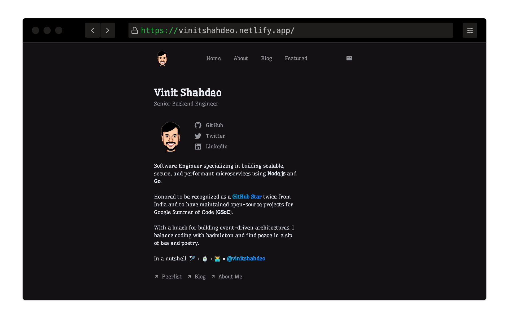

# Portfolio — Vinit Shahdeo [](https://astro.build)



Welcome to the repository hosting the source code of my portfolio to showcase my work and skills using [Astro](https://astro.build/) and [Tailwind](https://tailwindcss.com/) CSS.

The site is live at [vinitshahdeo.netlify.app](https://vinitshahdeo.netlify.app) and it's deployed on Netlify.

[](https://app.netlify.com/sites/vinitshahdeo/deploys) [](https://astro.build)

## 🚀 Getting started

1. Clone the repo

```
git clone https://github.com/vinitshahdeo/portfolio.git
cd portfolio
```

2. Install dependencies

```
npm i
```

3. Run the development server

```
npm run dev
```

## 🧞 Commands

All commands are run from the root of the project, from a terminal:

| Command           | Action                                       |
| :---------------- | :------------------------------------------- |
| `npm install`     | Installs dependencies                        |
| `npm run dev`     | Starts local dev server at `localhost:4321`  |
| `npm run build`   | Build your production site to `./dist/`      |
| `npm run lint`    | Lint your code, before deploying             |


## 🧐 What's inside?

The portfolio contains three main pages:

- **Home**: A welcome page with my brief introduction.
- **About**: Detailed information about me, my skills, and experience.
- **Featured**: My thoughts, stories, and interviews.


## 🙏 Acknowledgments

This is inspired by [Minimal portfolio template](https://astro.build/themes/details/minimal-portfolio-template/) by [Tim Witzdam](https://github.com/TimWitzdam).

## 📝 License

This project is licensed under the MIT License - see the [LICENSE](./LICENCSE) file for details.

## 📫 Contact

For any queries, feel free to get in touch via [Twitter](https://x.com/vinit_shahdeo) (𝕏) or follow me on [GitHub](https://github.com/vinitshahdeo).
